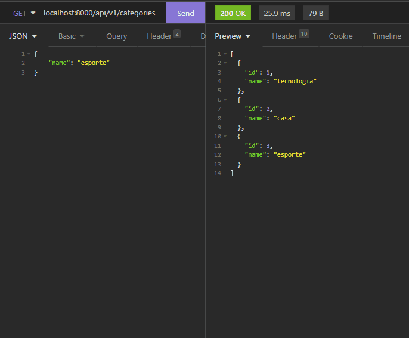
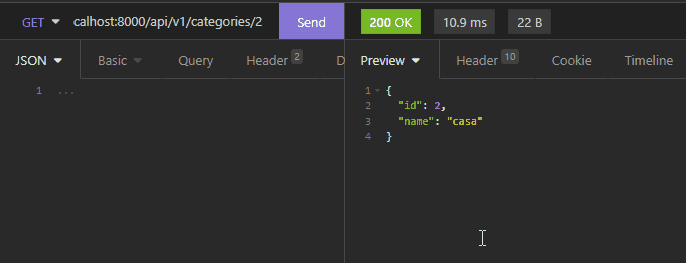
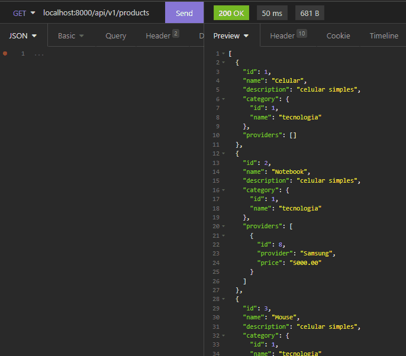
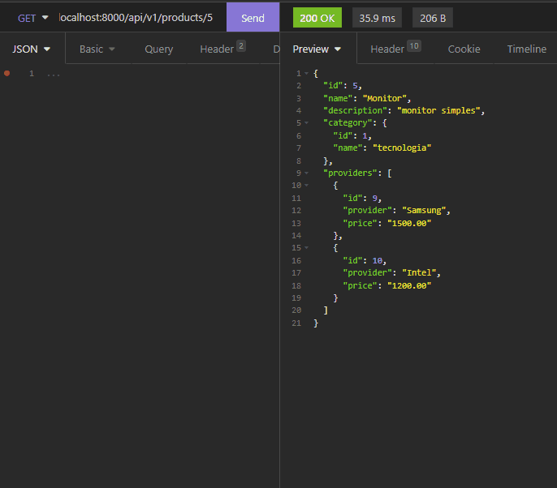
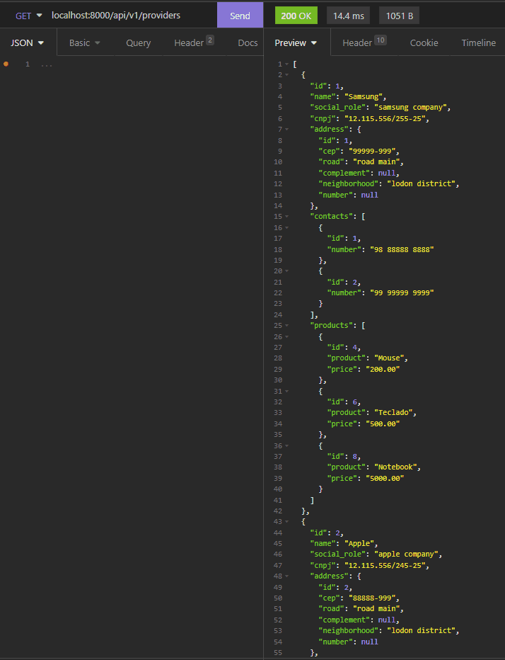
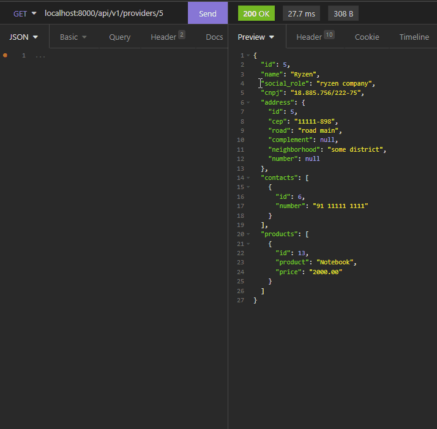
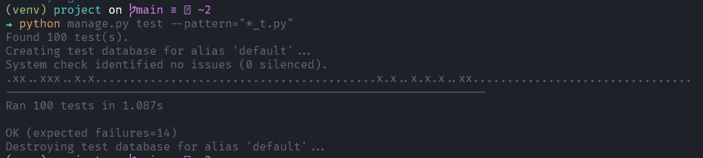

<h1>Sistema de produtos - Backend</h1>
<p>API para gerenciar sistema de produtos</p>

<br>
<h2>🔗 Tópicos</h2>
<ul>
<li><a href="#tools">Ferramentas</a></li>
<li><a href="#db">Banco de dados</a></li>
<li><a href="#doc">Documentação</a></li>
<ul>
    <li><a href="#organization">Organização</a></li>
    <li><a href="#serializers">Serializers</a></li>
    <li><a href="#routes">Views e rotas</a></li>
</ul>
<li><a href="#use">Como usar na sua máquina</a></li>
</ul>

<br>
<h2 id="tools">🛠️ Ferramentas</h2>

<ul>
<li><a href="https://docs.djangoproject.com/en/4.0/">Django</a></li>
<li><a href="https://www.django-rest-framework.org/">Django Rest Framework</a></li>
<li><a href="https://github.com/dhomini-rabelo/Fast">Fast</a></li>
<li><a href="https://github.com/dhomini-rabelo/Rest-Full-Control">Rest-Full-Control</a></li>
</ul>

<br>
<h2 id="db">🏷️ Modelagem do banco de dados</h2>


<h3>User</h3>
<ul>
<li>Username ( gerenciada pelo AbstractUser do Django )</li>
<li>Senha ( gerenciada pelo AbstractUser do Django )</li>
<li>Nome</li>
<li>Email</li>
</ul>

<h3>Categoria</h3>
<ul>
<li>Nome UNIQUE</li>
<li>Data de criação</li>
<li>Data de atualização</li>
</ul>

<h3>Produto</h3>
<ul>
<li>Nome UNIQUE</li>
<li>Descrição OP</li>
<li>Categoria FK</li>
<li>Data de criação</li>
<li>Data de atualização</li>
</ul>

<h3>Mediador de preços</h3>
<ul>
<li>Produto FK</li>
<li>Fornecedor FK</li>
<li>Preço</li>
</ul>

<h3>Endereço</h3>
<ul>
<li>Cep</li>
<li>Rua</li>
<li>Bairro</li>
<li>Complemento OP</li>
<li>Número OP</li>
</ul>

<h3>Fornecedor</h3>
<ul>
<li>Nome UNIQUE</li>
<li>Razão social OP</li>
<li>Cnpj</li>
<li>Endereço o2o</li>
</ul>


<h3>Contato</h3>
<ul>
<li>Fornecedor FK</li>
<li>Número</li>
</ul>

<br>
<br>
<h2 id="doc">📖 Documentação</h2>
<br>
<h3 id="organization">Organização</h2>

<ul>
<li>
Os padrões principais do projeto estão na pasta project/Core
</li>
<li>
Os apps estão na pasta project/backend
</li>
<li>
PRODUCTS é onde está a configuração do projeto
</li>
</ul>
<br>
<h3 id="serializers">Serializers</h3>
<br>
<br>
<h3 id="routes">Views e rotas</h3>
<p>Note que nas imagens e gifts também contêm os erros</p>
<br>
<br>
<hr>
<h3>CategoryListAndCreate - /categories</h3>
<p> 
GET: Lista categorias<br>
POST: Cria nova categoria
</p>
<br>
<kbd></kbd>

<br>
<br>
<hr>
<h3>CategoryDetail - /categories/[id]</h3>
<p> 
GET: Dados da categoria<br>
PUT: Atualiza todos os campos de categoria<br>
PATCH: Atualiza categoria<br>
DELETE: Deleta categoria
</p> 
<br>
<kbd></kbd>

<br>
<br>
<hr>
<h3>ProductDataControlAndCreate - /products</h3>
<p> 
GET: Lista produtos, seleciona campos desejados e faz filtros, usando <a href="https://github.com/dhomini-rabelo/Rest-Full-Control">Rest-Full-Control</a><br>
POST: Cria novo produto com ou sem fornecedor(es)
</p> 
<br>
<kbd></kbd>

<br>
<br>
<hr>
<h3>ProductDetail - /products/[id]</h3>
<p> 
GET: Dados da produto<br>
PUT: Atualiza todos os campos de produto | PATCH: Atualiza produto<br>
Altera categoria | cria, altera e deleta fornecedores<br>
Para alterar categoria basta indicar nome de outra categoria já cadastrada<br>
Para criar um fornecedor basta apenas indicar o nome ( ou id ) do novo fornecedor e o preço do produto<br>
Para alterar um fornecedor basta apenas indicar o nome ( ou id ) do fornecedor e o novo preço do produto<br>
Para deletar um fornecedor indique os ids para serem deletados em um array no campo "delete_providers"<br>
DELETE: Deleta produto
</p> 

<br>
<kbd></kbd>
<br>


<br>
<br>
<hr>
<h3>ProviderDataControlAndCreate - /providers</h3>
<p> 
GET: Lista produtos, seleciona campos desejados e faz filtros, usando <a href="https://github.com/dhomini-rabelo/Rest-Full-Control">Rest-Full-Control</a><br>
POST: Cria novo fornecedor
</p> 
<br>
<kbd></kbd>


<br>
<br>
<hr>
<h3>ProviderDetail - /providers/[id]</h3>
<p> 
GET: Dados da fornecedor<br>
PUT: Atualiza todos os campos de fornecedor | PATCH: Atualiza fornecedor<br>
Altera endereço | cria, altera e deleta fornecedores ou contatos<br>
Para criar um produto basta apenas indicar o nome ( ou id ) do novo produto e o preço do produto<br>
Para alterar um produto basta apenas indicar o nome ( ou id ) do produto e o novo preço do produto<br>
Para deletar um produto indique os ids para serem deletados em um array no campo "delete_products"<br>
Para criar um contato apenas indique um número novo<br>
Para alterar um contato apenas indique um número novo e o id do contato que quer alterar<br>
Para deletar um contato indique os ids para serem deletados em um array no campo "delete_contacts"<br>
DELETE: Deleta fornecedor
</p> 
<br>
<kbd></kbd>

<br>
<br>
<h2 id="tests">🧪 Testes</h2>

```
python manage.py test --pattern="*_t.py"
```

<br>
<kbd></kbd>

<br>
<h2 id="use">🚀 Como usar na sua máquina</h2>

<h3>Depois de clonar o projeto basta apenas seguir os comandos abaixo.</h3>
<br>

```
cd backend
python -m venv venv
venv/Scripts/Activate.ps1 # if use PowerShell
pip install -r requirements.txt
pip freeze > requirements.txt
cd project
python manage.py runserver
```